  

<a href="https://raghhavmalani.vercel.app"><samp>portfolio</samp></a>
&nbsp;·&nbsp;
<a href="https://www.linkedin.com/in/raghhav-malani-498546278/"><samp>linkedin</samp></a>
&nbsp;·&nbsp;
<a href="mailto:raghhavmalani24@gmail.com"><samp>email</samp></a>

Final-year CS · PES University, Bengaluru · Class of 2027
 
<samp><b>Paytm</b> — Data & Risk Analytics&nbsp;&nbsp;·&nbsp;&nbsp;<b>Reliance Jio</b> — AI Research</samp>

 

## RouteEngine

<samp><a href="https://github.com/RaghhavMalani/RouteEngine">repository</a> · <a href="https://route-engine-five.vercel.app">live demo</a></samp>

A cinematic 3D visualizer of how map routing actually works, built on Bengaluru's real road network — 220,723 nodes and 279,814 edges from OpenStreetMap. The same route is solved by escalating methods, each stage visibly rebuilding on the last:

Traffic-aware rerouting, live incident injection, and a correctness gate validating CH against plain Dijkstra across 200 random routes with zero error.

<samp>TypeScript · deck.gl · MapLibre · GPU-driven animation · graph algorithms</samp>

 

## FinSight Alpha

<samp><a href="https://github.com/RaghhavMalani/finsight-alpha">repository</a> · <a href="https://finsight-alpha-mocha.vercel.app">live</a></samp>

A local-first quantitative research terminal. Black–Scholes options pricing, Monte Carlo VaR/CVaR, Markowitz portfolio optimization, an ensemble ML signal lab with walk-forward validation, Gaussian HMM regime detection, and RAG-powered research over filings.

<samp>Python · FastAPI · scikit-learn · FAISS · quantitative finance</samp>

 

## India PortWatch

<samp><a href="https://github.com/RaghhavMalani/LogisticOptimization-_Capstone_168">repository</a></samp>

A predictive counterpart to IMF PortWatch for Indian ports: per-port congestion, delay, and throughput forecasting up to 10 days ahead, operational regime inference, event-shock scenario simulation, and routing recommendations.

<samp>Python · time-series forecasting · logistics analytics</samp>

 

## miniRAFT

<samp><a href="https://github.com/RaghhavMalani/miniRAFT_project">repository</a></samp>

A collaborative real-time drawing board backed by a Raft consensus cluster built from scratch — leader election, log replication, and catch-up synchronization across three replicas, with WebSocket fan-out of committed strokes to every connected browser.

<samp>JavaScript · distributed systems · consensus · WebSockets</samp>

 

---

<a href="https://github.com/RaghhavMalani/Real-Time-Ride-Sharing-Dispatch-System">ride-sharing dispatch</a> — spatial driver matching, FastAPI + MySQL + WebSockets
&nbsp;·&nbsp;
<a href="https://github.com/RaghhavMalani/neetcode-submissions">neetcode</a> — ongoing DSA practice

  

<samp>Python · TypeScript · SQL / DuckDB · FastAPI · React · scikit-learn · FAISS · deck.gl</samp>

